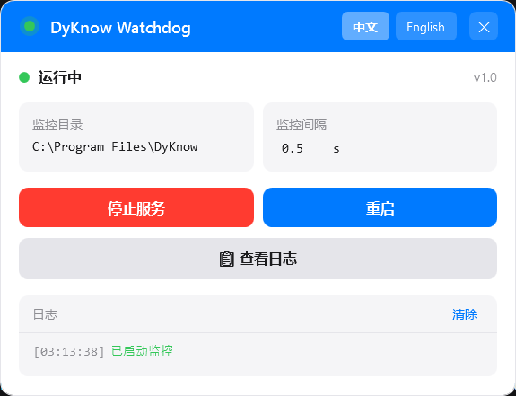

# DyKnow Watchdog (DyknowBlocker)

> 新世代 .NET 9 / WPF 版本 —— 旧版 WinForms 实现（v1.0–v1.2，位于 `Blocker/`，`git tag v1.x`）的完整重写。

一个 Windows 桌面工具：监控 DyKnow 目录树下的所有进程，并自动终止**除 DyKnow.exe 本体外**的所有进程，用于阻断 DyKnow 课堂监控软件的运行。

- 简体中文 / English 双语界面
- 风格参考 `docs\superpowers\specs\dyknow-preview.html`（UI 完全一致）



## 功能特性

| 功能 | 说明 |
|------|------|
| 🎯 目录发现 | 优先 `C:\Program Files\DyKnow\`；不存在时自动定位运行中的 DyKnow.exe，取其「父父目录」（`<root>\Client\DyKnow.exe` → `<root>`） |
| 🔫 进程终止 | 定时扫描目录树，杀死除 DyKnow.exe 外的所有进程；权限不足自动跳过并记日志 |
| ⏱️ 监控频率可配置 | 默认 0.5s，支持 0.1–3600s（小数秒），界面上直接编辑，持久化到设置 |
| 📋 文件日志 | `%LOCALAPPDATA%\DyKnowWatchdog\Logs\`，每日一个文件（yyMMdd.log）、单文件 5MB 轮换、30 天自动清理 |
| 🖥️ 系统托盘 | 运行绿点 / 停止红点；右键菜单：打开窗口 / 启动·停止服务 / 开机自启动 / 退出；关闭窗口最小化到托盘 |
| 🚀 开机自启 | HKCU `Run` 注册（托盘菜单勾选） |
| 🌐 中英双语 | 一键切换，所有文案集中管理 |

## 运行环境

- Windows 10 / 11（x64）
- [.NET 9 Desktop Runtime](https://dotnet.microsoft.com/download/dotnet/9.0)

## 快速开始

```powershell
# 构建
dotnet build DyKnowWatchdog.sln

# 测试
dotnet test DyKnowWatchdog.sln

# 运行
dotnet run --project DyKnowWatchdog
# 或直接执行：
./DyKnowWatchdog/bin/Debug/net9.0-windows/DyKnowWatchdog.exe
```

启动后应用会自动开始监控（可在托盘菜单取消）。关掉窗口不会退出程序——它会收进系统托盘，需在托盘菜单选择「退出」。

## ⚠️ 使用须知

- 本工具会**强制终止**指定目录下的所有非 DyKnow.exe 进程（包括 DyKnow 的辅助程序，如 `DyKnowLiveLog.exe`、`DyKnowLogSender.exe` 等）。请确认目标目录正确后再开启监控。
- 无管理员权限时，部分进程可能无法终止（会记录「权限不足，跳过」）。
- 仅供教学/自用场景使用；请遵守你所在环境的软件许可与使用政策。

## 配置与数据位置

| 项目 | 位置 |
|------|------|
| 设置文件 | `%LOCALAPPDATA%\DyKnowWatchdog\settings.json` |
| 日志目录 | `%LOCALAPPDATA%\DyKnowWatchdog\Logs\` |
| 开机自启 | `HKCU\Software\Microsoft\Windows\CurrentVersion\Run`（值名 `DyKnowWatchdog`） |

## 项目结构

```
DyKnowWatchdog.sln
├── DyKnowWatchdog/            # WPF 主程序 (.NET 9)
│   ├── App.xaml.cs            # 组合根（组装 Services / ViewModel / Window）
│   ├── MainWindow.xaml        # 主窗口 UI
│   ├── ViewModels/            # MainViewModel + 双语文案 (UiText zh/en)
│   ├── Services/
│   │   ├── WatchdogService.cs           # 核心监控：定时扫描 + 杀进程
│   │   ├── MonitorDirectoryLocator.cs   # 目录发现
│   │   ├── FrequencyParser.cs           # 监控频率解析
│   │   ├── LogService.cs                # 文件日志（分割/轮换/清理）
│   │   ├── AppSettings.cs               # 设置持久化
│   │   ├── AutoStartRegistry.cs         # 开机自启
│   │   └── ProcessSource / ProcessKiller  # 进程枚举与终止（接口抽象，便于测试）
│   └── Resources/             # 应用图标
└── DyKnowWatchdog.Tests/      # xUnit 单元测试（71 个用例）
```

## 开发

后续开发者请先阅读 [AGENTS.md](AGENTS.md)：包含架构说明、目录发现规则、频率配置约定、TDD 开发要求（0 警告 0 错误、测试先行）等。

## 许可证

仓库沿用 MIT License（见 [LICENSE](LICENSE)）。本项目为新代码重写，版权归属以 LICENSE 文件为准。